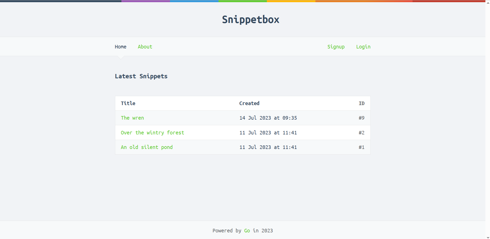
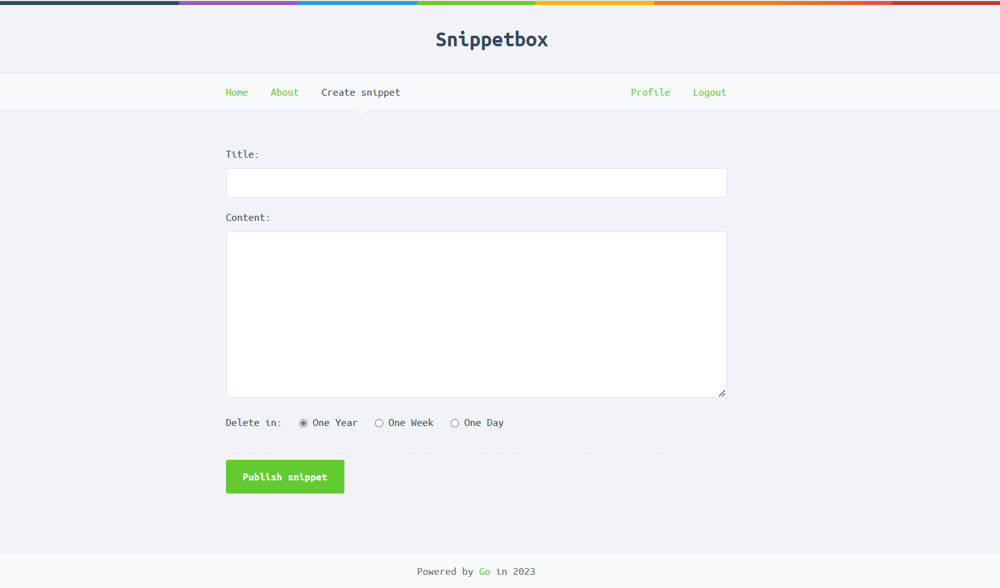
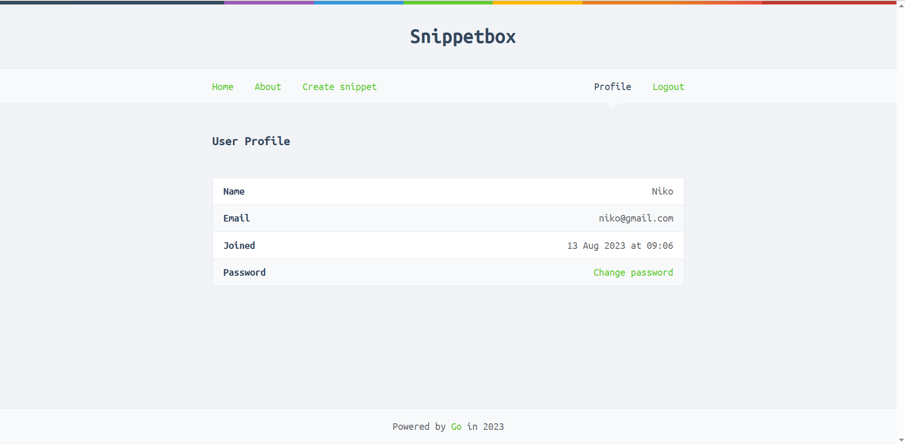

# A web application called Snippetbox

## lets people paste and share snippets of text

## a bit like Pastebin or GitHub’s Gists
> Web App tutorial via Let's Go by Alex Edwards

## Home Page

## Create Snippet

## Profile

